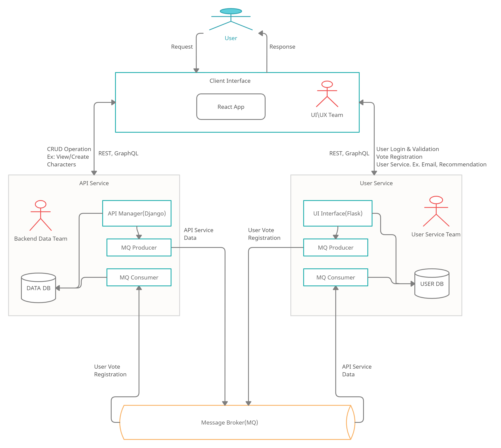

# Example Microservices Architecture

Example Microservices Architecture with Django(API), Flask(UI), MySQL, REST, Docker and Kubernetes.

## <u>Features</u>

* Django API Application.
* Flask User Application.
* React UI Interface(TODO).
* App Integrated with Docker.
* App Integrated with Kubernetes.
* Service Mesh([Istio](https://istio.io/) - TODO)
* Monitoring([Prometheus](https://prometheus.io/) - TODO)

---

## <u>Architecture</u>

---

## License

[MIT](https://choosealicense.com/licenses/mit/)